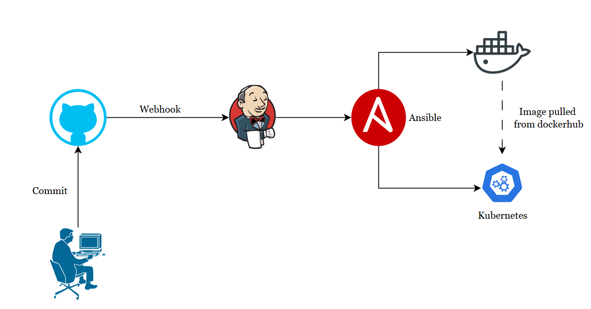

# Project: Automated CI/CD Pipeline with Jenkins, Ansible, Docker, and Kubernetes

## Project Overview

This project demonstrates the implementation of a fully automated CI/CD
pipeline for deploying a web application. The pipeline integrates
multiple technologies, including Jenkins, Ansible, Docker, and
Kubernetes, hosted on AWS EC2 instances. The objective is to automate
the process of building, testing, and deploying containerized
applications to a Kubernetes cluster.

## Technologies Used

-   **Cloud Platform**: AWS EC2 (for hosting servers)

-   **CI/CD Tool**: Jenkins

-   **Configuration Management**: Ansible

-   **Containerization**: Docker

-   **Container Orchestration**: Kubernetes (via Minikube)

-   **Version Control**: GitHub

## Infrastructure Setup

1.  **Servers and Software Installed**:

    -   **Jenkins Server**: Jenkins + JRE

    -   **Ansible Server**: Python + Ansible + Docker

    -   **Kubernetes Server**: Docker + Minikube

2.  **Network Configuration**:

    -   Secure SSH connections between all servers.

    -   Webhooks configured for real-time GitHub-Jenkins integration.

## Responsibilities

As a key contributor to this project, my responsibilities included:

1.  **Infrastructure Setup**:

    -   Provisioned and configured AWS EC2 instances for Jenkins,
        Ansible, and Kubernetes.

    -   Installed necessary software packages on each server to support
        the CI/CD pipeline.

2.  **Pipeline Development**:

    -   Designed and implemented the Jenkins pipeline script to automate
        the build and deployment processes.

    -   Integrated GitHub with Jenkins for seamless source code
        management and triggering builds.

3.  **Automation Scripting**:

    -   Developed scripts for Docker and Ansible installation on the
        respective servers.

    -   Created a playbook for sensible automation on creation on
        kubernetes pods without any manual intervention.

4.  **Troubleshooting and Optimization**:

    -   Identified and resolved issues encountered during pipeline
        execution.

    -   Optimized the pipeline for performance by implementing best
        practices in scripting and configuration management.

5.  **Documentation and Reporting**:

## Created comprehensive documentation outlining the project architecture, technologies used, challenges faced, and solutions implemented.

## Problems Faced During Execution

### 1. SSH Connection Failures Between Servers

**Problem**: Intermittent SSH connection failures occurred when
attempting to communicate between Jenkins, Ansible, and Kubernetes
servers, disrupting the file transfer and deployment processes.

**Solution**: Verify network configurations and ensure that SSH keys are
correctly set up for passwordless authentication between servers by
creating keygen; additionally ping between servers ensured that servers
can communicate with each other.
